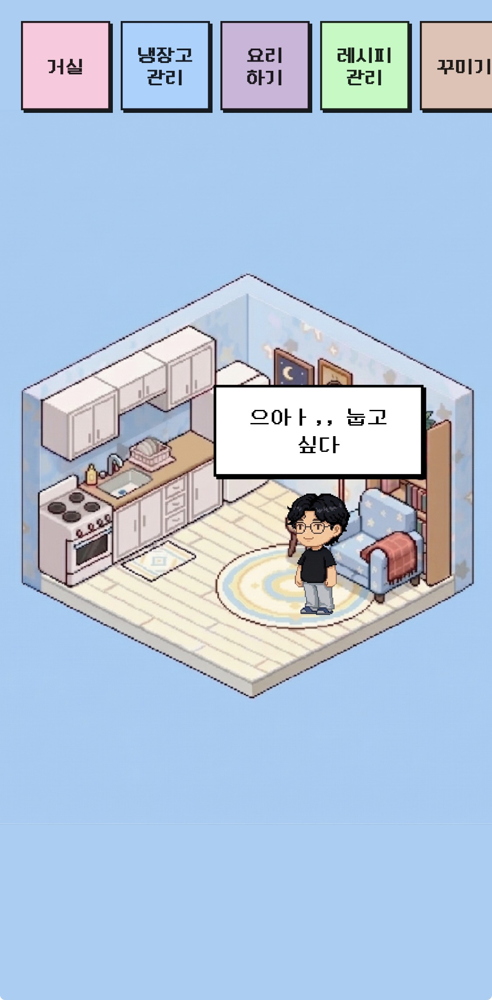
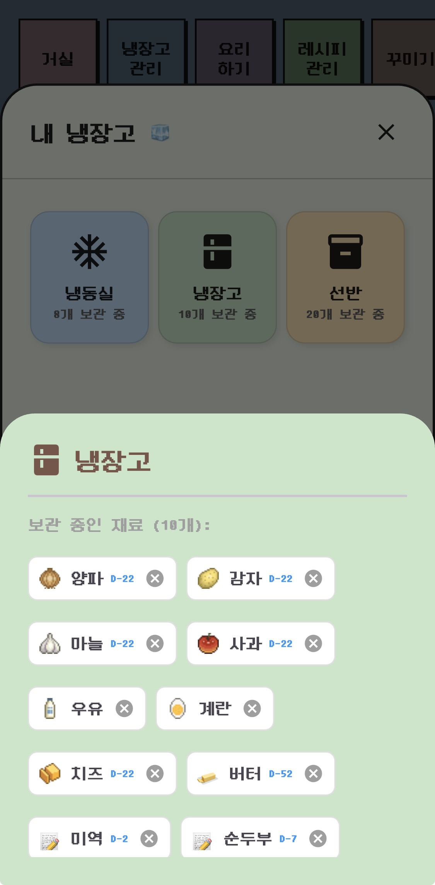

  

<h1 align="center">🍳 Lazy 2 Cook</h1>
<h3 align="center">Hybrid Cloud & Offline-First Recipe Management System for Single-Person Households</h3>

  
  
  

**Lazy 2 Cook** is a production-ready mobile application designed to tackle food waste in single-person households. By combining smart inventory tracking with an algorithmic recommendation engine, the app helps users maximize their ingredients and maintain healthy cooking habits.

---

## 🚀 Key Engineering Highlights

### 1. Offline-First & Hybrid Cloud Architecture
To ensure a seamless user experience regardless of network stability, I architected a robust **Offline-First** synchronization layer:
* **Real-time Sync:** Leveraged **Firebase Firestore** for cross-device recipe data synchronization.
* **Robust Fallback:** Implemented a local persistence layer using **JSON files and SharedPreferences**, allowing users to manage inventory and view recipes even in dead zones.

### 2. Rule-Based Recommendation Engine
Moved beyond simple keyword matching to build a custom **cross-validation logic** for ingredient management:
* **Smart Ranking:** Recipes are dynamically ranked based on 'missing ingredients' from the user's current fridge inventory.
* **Automation:** Automatically generates optimized shopping lists, bridging the gap between inventory management and meal preparation.

### 3. Custom 2D Isometric UI & Animations
Departing from generic Material/Cupertino designs, I engineered a unique **2D isometric environment** from scratch:
* **Custom Logic:** Built zooming and positioning logic for interactive pixel-art avatars without relying on standard navigation components.
* **User Engagement:** Integrated interactive animations to create a gamified, "Tamagotchi-style" experience that incentivizes consistent usage.

### 4. Native System Integrations & Social Sharing
* **Image Processing:** Developed a custom photo overlay feature using `image_picker` and `RepaintBoundary` to allow users to apply 2D stickers to their dishes.
* **Social Export:** Integrated `share_plus` to export high-resolution renders directly to **Instagram Stories**.
* **Monetization:** Successfully integrated the **Google AdMob** pipeline (Banner & Native ads) to validate the app's commercial viability.

---

## 🛠 Tech Stack
* **Language:** Dart
* **Framework:** Flutter (iOS & Android)
* **Backend:** Firebase (Auth, Firestore)
* **State Management:** Provider / BLoC
* **Storage:** SharedPreferences, Local JSON 
* **Ads:** Google AdMob 

---

## 📸 Screen Previews

| Interactive Home | Inventory Management | Recipe Recommendations |
| :---: | :---: | :---: |
|  |  |  |

---

## 📈 Future Roadmap
* **Probabilistic Modeling:** Integrate the **SOA Exam P**-based probability theories to predict ingredient decay and user habit patterns.
* **Deep Learning Integration:** Implement on-device image classification for automatic ingredient logging.

---

## 👨‍💻 Author
**Minjae Lee**
* Applied Mathematics & Statistics @ Stony Brook University
* Incoming Data Science & Mathematics @ New York University (NYU)
* [LinkedIn](https://linkedin.com/in/minjaelee-435b35388) | [Email](mailto:minjae.lee.2@stonybrook.edu)
